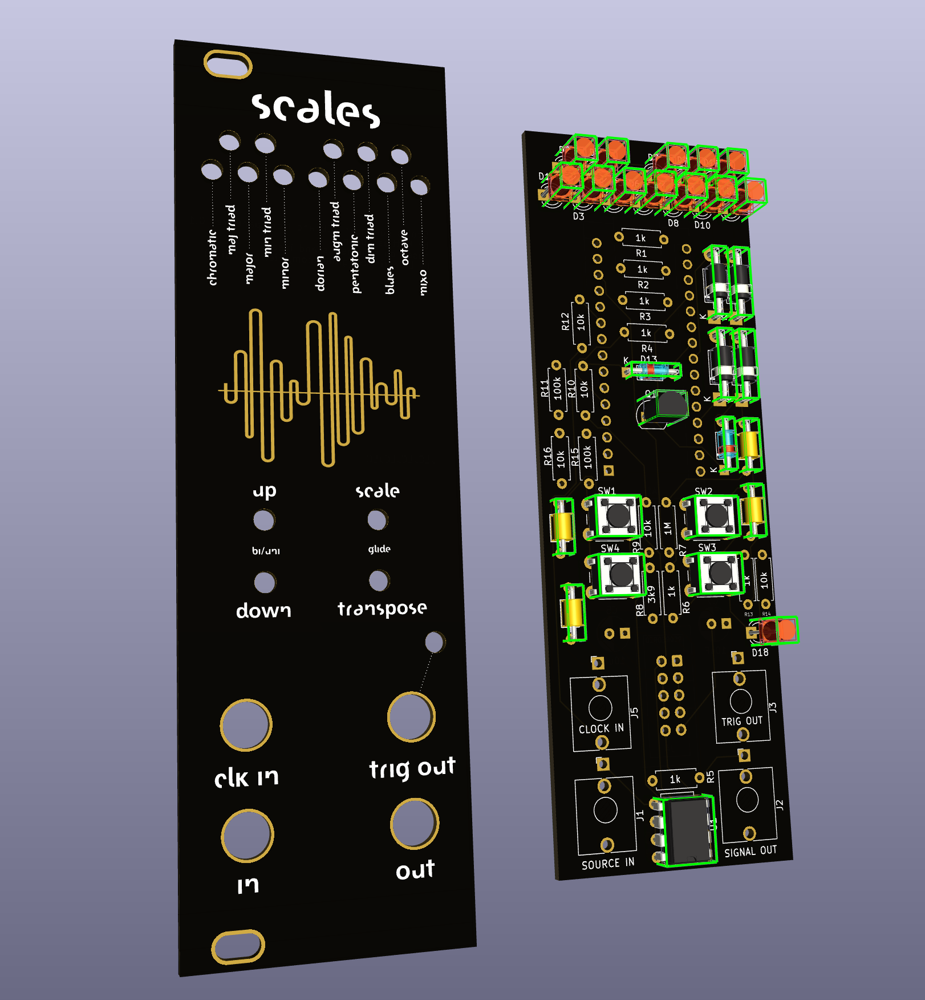

# scales
Scales is a quantizer first made by L.Geerinckx as a perfboard version. I wanted to see if I could learn a bit about schematics and PCB making, so I chose this module to be my first project, since I also needed a quantizer in my rack.

I decided to make some changes to the layout of the front panel, which you can see here.

Original repo: https://github.com/PierreIsCoding/sdiy/tree/main/Quantizer
